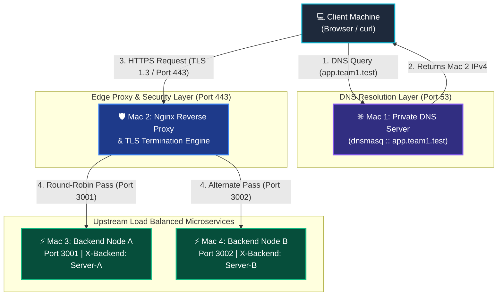
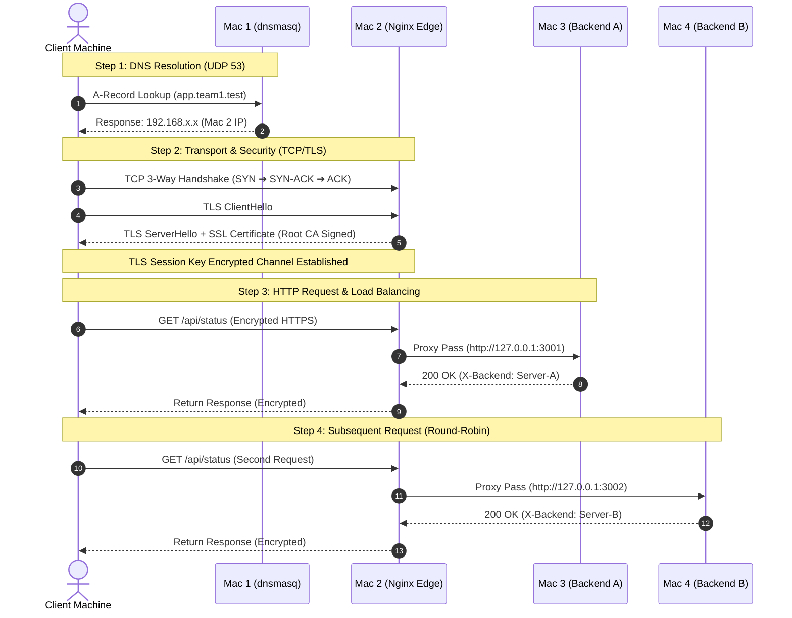

# 🌐 CloudPulse — Private Network Service Platform
> **Computer Networks Course Project — Phase 1 & 2 Build & Observe**


CloudPulse is a high-availability, distributed local network service platform simulating enterprise cloud infrastructure across a private local area network (LAN). It demonstrates full packet traversal, private DNS resolution, edge reverse proxying, TLS termination, round-robin load balancing, and HTTP caching.

---

## 🎨 Network Architecture Topology (Mermaid Diagram)



---

## ⚡ End-to-End Protocol Flow Sequence (Mermaid Diagram)



---

## 🖥️ Machine Roles & Topology Inventory

| Machine Role | Services Running | Interface & Listening Ports | Cloud Equivalent |
| :--- | :--- | :--- | :--- |
| **Mac 1** (Private DNS) | `dnsmasq`, `dig`, `nslookup` | `0.0.0.0:53 (UDP/TCP)` | AWS Route 53 / Cloudflare DNS |
| **Mac 2** (Edge Proxy) | `Nginx`, TLS SSL Engine | `0.0.0.0:443 (HTTPS)`, `80` | AWS Application Load Balancer (ALB) |
| **Mac 3** (Backend A) | Node.js Express REST API | `0.0.0.0:3001 (HTTP)` | Compute Instance / EC2 A |
| **Mac 4** (Backend B) | Node.js Express REST API | `0.0.0.0:3002 (HTTP)` | Compute Instance / EC2 B |

---

## 📊 Course Rubric Task Mapping (Phase 1)

| Task | Objective | Deliverable / Artifact |
| :--- | :--- | :--- |
| **Task A** | Establish Private LAN | [`docs/ARCHITECTURE_PHASE1.md`](docs/ARCHITECTURE_PHASE1.md) |
| **Task B** | Configure Private DNS | [`dns/dnsmasq.conf`](dns/dnsmasq.conf) |
| **Task C** | Build 2 REST Backends | [`backend-a/server.js`](backend-a/server.js), [`backend-b/server.js`](backend-b/server.js) |
| **Task D** | Edge Proxy & Load Balancer | [`nginx/nginx.conf`](nginx/nginx.conf) |
| **Task E** | HTTPS / TLS Termination | [`certs/generate_certs.sh`](certs/generate_certs.sh) |
| **Task F** | HTTP Caching & 304 | [`public/app.js`](public/app.js) (`/api/data`) |
| **Task G** | Wireshark Protocol Flow | [`docs/VIVA_GUIDE_PHASE1.md`](docs/VIVA_GUIDE_PHASE1.md) |

---

## 🔍 Wireshark Packet Evidence Filters

| Protocol Layer | Wireshark Display Filter | Evidence to Highlight |
| :--- | :--- | :--- |
| **DNS** | `dns.flags.response == 1` | Resolves `app.team1.test` to Mac 2 IPv4 |
| **TCP Handshake** | `tcp.port == 443 && tcp.flags.syn == 1` | 3-way handshake (`SYN` ➔ `SYN-ACK` ➔ `ACK`) |
| **TLS Handshake** | `tls.handshake.type == 1` | `ClientHello`, `ServerHello`, Certificate validation |
| **HTTP Payload** | `http || tls` | Request headers & `X-Backend` header distribution |

---

## 🚀 Quick Execution Guide

```bash
# 1. Install Dependencies
cd backend-a && npm install && cd ../backend-b && npm install && cd ..

# 2. Start Local Microservices
./start_all.sh

# 3. Execute Automated Phase 1 Test Runner
./test_phase1.sh
```

---

## 📄 Documentation & Reports

- 📘 [Phase 1 Architecture Specifications](docs/ARCHITECTURE_PHASE1.md)
- 📗 [Viva Presentation Cheat Sheet & Q&A](docs/VIVA_GUIDE_PHASE1.md)
